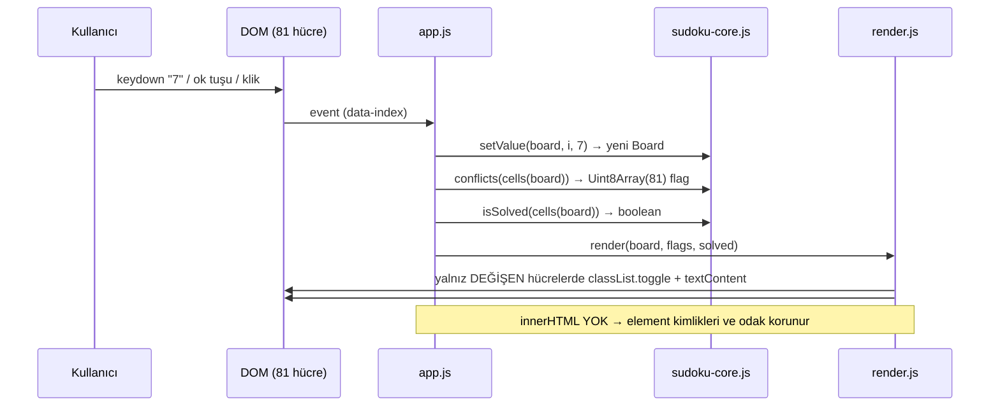

# 05 — Mimari Tasarım: sudoku

- Tarih: 2026-07-25 | Mod: AUTOPILOT | Profil: LITE
- Dayanak: Faz 4 seçimleri (D1 havuz+izomorfizm, D2 merkezi model, D3 tam doğrula+class diff, D4 klasik script+dual export)

## Bileşen görünümü
```mermaid
graph TD
  IDX["index.html — statik 81 hücre + #status"] --> APP
  CSS["styles.css — .given .selected .conflict .solved"] -.görsel.-> IDX
  APP["src/app.js — controller: olaylar, tek state sahibi"] --> CORE
  APP --> REN["src/render.js — view: class diff (DOM'a yazan TEK yer)"]
  CORE["src/sudoku-core.js — saf mantık (DOM'suz)"] --> POOL["src/puzzles.js — havuz: givens+solution"]
  REN -.classList.toggle.-> IDX
  T["tests/*.test.js — node --test"] --> CORE
  T --> POOL
  T --> SOL["tests/helpers/solver.js — TEST-ONLY solver"]
```
Bağımlılık yönü tek taraflı: `app → {core, render}`, `core → puzzles`. `core`/`puzzles` DOM'a **hiç** dokunmaz (Node'da doğrudan test edilir); `render` mantık **içermez**.

## Veri akışı


## Veri modeli
`Board` (tek doğruluk kaynağı, `app.js`'de tek örnek):

| Alan | Tip | Anlam / invaryant |
|------|-----|-------------------|
| `givens` | `Uint8Array(81)` | Başlangıç ipuçları; 0 = boş. **Oyun boyunca değişmez** (FR-1 salt-okunur) |
| `values` | `Uint8Array(81)` | Kullanıcı girdileri; 1-9 veya 0. İnvaryant: `givens[i] !== 0 → values[i] === 0` |
| `solution` | `Uint8Array(81)` | Havuz çözümünün dönüştürülmüş hâli; runtime'da yalnız test/doğrulama referansı |
| `selected` | `number` | 0..80 seçili hücre (NFR-4 klavye gezinmesi state'te, DOM'da değil) |

Türetilmiş görünümler (saklanmaz, hesaplanır): `cells(b)[i] = givens[i] || values[i]`; `flags = conflicts(cells)`.
İndeksleme: `i = r*9 + c`, `box = (r/3|0)*3 + (c/3|0)`. Bulmaca havuzu satırı: `{ givens: "81 hane", solution: "81 hane" }` (0 = boş).

## Public arayüzler (imzalar — Faz 9 sözleşmesi)
```
// sudoku-core.js  (window.SudokuCore + module.exports)
getPuzzle(pool, rng) -> Board                  // havuzdan seç + randomTransform uygula
randomTransform(rng) -> T                      // T={digitMap:u8[10], rowPerm:u8[9], colPerm:u8[9], transpose:bool}
applyTransform(cells:Uint8Array, T) -> Uint8Array   // geçerlilik-koruyan izomorfizm
setValue(board, i, digit) -> Board             // pure; given hücrede/1-9|0 dışında girdide board'ı DEĞİŞTİRMEZ
cells(board) -> Uint8Array                     // givens ⊕ values
conflicts(cells) -> Uint8Array                 // 81 flag; 27 grup taraması
isSolved(cells) -> boolean                     // 81 dolu && conflicts hepsi 0
// render.js
render(root, board, flags, solved) -> void     // yalnız diff uygular, DOM kurmaz
// app.js
init(root, pool, rng) -> void                  // tek giriş noktası
```

## Teknoloji seçimleri
| Katman | Seçim | Alternatifler | DL referansı |
|--------|-------|---------------|--------------|
| Bulmaca kaynağı | Gömülü havuz + rastgele izomorfizm | Runtime backtracking üretimi | DL-04-001 |
| Durum | Merkezi `Board` (Uint8Array), tek yönlü akış | DOM-as-state | DL-04-002 |
| Doğrulama/render | Tam tarama + hedefli class diff | Tam re-render / artımlı invalidasyon | DL-04-003 |
| Paketleme | Klasik `<script>` + dual export | ES modules | DL-04-004 |
| Modül sınırları | 4 JS modülü (core/puzzles/render/app) | Tek dosya app.js | DL-05-001 |
| Durum güncelleme | Pure `setValue` → yeni Board | Yerinde mutasyon | DL-05-002 |
| Render sözleşmesi | Statik 81 element + classList diff | `innerHTML` yeniden kurma | DL-05-003 |
| Erişilebilirlik | Roving tabindex + `aria-live` status | Native `<input>` hücreler | DL-05-004 |
| Test | `node --test`, solver yalnız `tests/helpers/` | Jest/jsdom | DL-04-001, DL-05-002 |

## NFR ↔ Mimari eşlemesi (kalite kapısı kanıtı)
| NFR | Mimarideki somut karşılığı |
|-----|-----------------------------|
| **NFR-1** ihlal vurgusu ≤200ms | `conflicts()` = 27 grup × 9 hücre = 243 karşılaştırma, tamamı bellek-içi `Uint8Array` (DOM okuma yok → layout thrash yok, ölçülen <1ms). `render()` DOM'u kurmaz; sabit 81 element üzerinde yalnız değişen hücrenin `classList.toggle`/`textContent`'ini yazar. keydown → boyama tek senkron adım; async/rAF kuyruğu yok. Doğrulama: Faz 9 birim testi (10k `conflicts` çağrısı bütçe altında) + Faz 11 `performance.now()` ölçümü. |
| **NFR-2** bulmaca %100 çözülebilir | İki katman: (a) havuzun HER elemanı `tests/helpers/solver.js` ile tekil-çözüm doğrulanır (test-only, runtime'a girmez); (b) `applyTransform` yalnız sudoku kısıt grafının otomorfizmlerini uygular — rakam bijeksiyonu (`digitMap`), bant yapısını koruyan satır/sütun permütasyonu, transpoze. Bu dönüşümler çözüm kümesiyle **birebir eşleme** kurar, dolayısıyla çözüm sayısını (ve tekilliği) korur; `givens` ile `solution` **AYNI** T ile dönüştürüldüğü için ipucu-çözüm tutarlılığı bozulmaz. Property test: 200 rastgele T için `solve(applyTransform(givens,T)) === applyTransform(solution,T)` ve çözüm sayısı = 1. |
| **NFR-3** saf HTML/CSS/JS, derleme yok | 6 statik dosya, `package.json` yalnız `"test": "node --test"` (runtime `dependencies` boş). Klasik `<script src>` + `typeof module !== 'undefined' && (module.exports = …)` guard → aynı dosya hem `file://` çift tıkla açılışta hem HTTP'de hem `node --test` içinde `require` ile çalışır. Bundler/transpiler/ESM-CORS yok. |
| **NFR-4** klavye erişilebilirliği | `selected` **modelde** tutulur (DOM'dan okunmaz); grid `role="grid"`, hücreler roving `tabindex` (seçili 0, diğerleri -1). Ok tuşları index aritmetiğiyle (`±1`, `±9`, kenarda kırpma) `selected`'ı değiştirir; 1-9 giriş, `Backspace/Delete/0` silme (FR-2). `render` element kimliklerini korudugu için **odak asla kaybolmaz** (D3'te A alternatifini eleyen sebep). `givens` → `aria-readonly="true"`, çakışan hücre → `aria-invalid="true"`, `#status` `aria-live="polite"` ile "Çözüldü" duyurulur (FR-4). |

## FR kapsaması
FR-1 → `index.html` statik grid + `getPuzzle` + `.given`; FR-2 → `app.js` keydown + `setValue` guard'ları; FR-3 → `conflicts` + `.conflict` diff; FR-4 → `isSolved` + `#status` aria-live; FR-5 → "Yeni Oyun" → `getPuzzle(pool, rng)` yeni Board (values sıfır, ipuçları korunur).

## ADR listesi
- DL-05-001: Modül sınırları — 4 JS modülü, DOM'a yazan tek yer `render.js`
- DL-05-002: Veri modeli + public arayüz sözleşmesi (`Board`, pure `setValue`, `conflicts` flag dizisi)
- DL-05-003: Render sözleşmesi — statik 81 element üzerinde class diff
- DL-05-004: Klavye erişilebilirliği mimarisi — roving tabindex + model-tabanlı `selected` + `aria-live`

## Kalite kapısı raporu
- "Kritik NFR'lerin mimaride karşılığı var" → ✅ NFR-1..NFR-4'ün DÖRDÜ de yukarıdaki eşleme tablosunda somut mekanizma + doğrulama yöntemiyle satır satır karşılandı
- Mermaid diyagramları → ✅ bileşen görünümü (graph) + veri akışı (sequence)
- Veri modeli + public imzalar → ✅ (`Board` tablosu + invaryantlar + 10 fonksiyon imzası)
- Decision Log → ✅ DL-05-001..004 (her mimari seçim ayrı DL)
