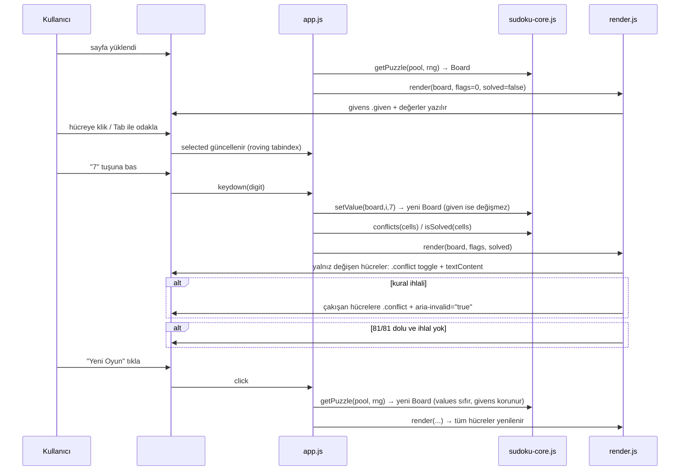

# 06 — UI/UX: sudoku

- Tarih: 2026-07-25 | Mod: AUTOPILOT | Profil: LITE
- Ürün tipi: web → tek sayfa (statik HTML + vanilla JS, 81 statik DOM hücresi — bkz. `docs/05-architecture.md`)

Girdi: `docs/03-requirements.md` (FR-1..5, NFR-1..4), `docs/05-architecture.md`.

## Yüzey sözleşmesi (tek ekran)
| Öğe | Rol | Etkileşim | İlgili FR/NFR |
|-----|-----|-----------|----------------|
| Başlık `<h1>` "Sudoku" | Sayfa kimliği | — | — |
| Izgara `
` (81 hücre `role="gridcell"`) | 9x9 tahta, 3x3 kutu ayrımı CSS border ile | Klik/Tab ile seçim, ok tuşlarıyla gezinme | FR-1, NFR-4 |
| Hücre (`.given` / `.selected` / `.conflict`) | Değer gösterimi | `given` salt-okunur; diğerleri 1-9 giriş, Backspace/Delete/0 silme | FR-1, FR-2, FR-3 |
| Durum satırı `
` | "Çözüldü" bildirimi | Tahta 81/81 dolu + ihlal yoksa görünür | FR-4, NFR-4 |
| "Yeni Oyun" butonu `<button id="new-game">` | Sıfırla | Click/Enter → havuzdan yeni bulmaca | FR-5 |

Yalnız klavye + fare — dokunmatik/çok dokunuşlu jest zorunlu değil (NFR-3 kapsamı dışı, v1 varsayımı).

## Ana akış — uçtan uca (kalite kapısı)

Klavye akışı: `Tab` ile ızgaraya gir (roving `tabindex`, seçili hücre 0) → ok tuşlarıyla `±1`/`±9` hareket (kenarda kırpılır) → `1-9` yaz, `Backspace/Delete/0` sil → `Tab` ile "Yeni Oyun"a ulaş, `Enter`/`Space` ile tetikle (FR-5, NFR-4).

## Çıktı/görsel şablonları
- **Başlangıç durumu:** Izgara dolu/boş karışık render edilir; `given` hücreler koyu arka plan + kalın font, boş hücreler tıklanabilir; `#status` boş.
- **Giriş sırasında:** Seçili hücre `.selected` (belirgin çerçeve); girilen rakam normal fontla anında görünür (NFR-1: ≤200ms).
- **İhlal durumu:** Çakışan TÜM hücreler (girilen + çakıştığı diğerleri) `.conflict` (kırmızı metin/arka plan) + `aria-invalid="true"`; çakışma giderilince aynı karede kalkar.
- **Çözüldü durumu:** `#status` "🎉 Çözüldü!" metni, `aria-live="polite"` ile duyurulur; tahta salt-görsel kalır (giriş engellenmez, FR-4 yalnız bildirim ister).
- **Hata/kenar durumları:** 1-9 dışı tuş → hücre değişmez (sessiz yoksay, hata mesajı yok — FR-2 kabul kriteri); JS devre dışıysa `<noscript>` "Bu oyun JavaScript gerektirir" mesajı gösterilir; tarayıcı desteklemiyorsa (çok eski) ek fallback yok (NFR-3 kapsamı: güncel Chrome/Firefox/Edge).

## Tasarım notları
- **Palet/kontrast:** Beyaz/açık gri tahta, 3x3 kutu ayrımı kalın border; `.given` koyu gri arka plan, `.conflict` kırmızı — metin/arka plan kontrastı ≥4.5:1 hedefi.
- **Boyut:** Bağımlılıksız 4 JS + 1 CSS + 1 HTML dosya, derleme yok (NFR-3).
- **Responsive:** Izgara `aspect-ratio:1`, `max-width` ile ortalanır; ≥360px mobil viewport'ta okunur kalır (dokunmatik giriş v1 kapsamı dışı).
- **Ton:** Minimalist, coinflip/dice-game/calculator ile tutarlı düz-renk arayüz; emoji yalnız "Çözüldü" bildiriminde.

## Kalite kapısı raporu
- "Ana kullanıcı akışları uçtan uca çizildi" → ✅ GEÇTİ — tek ana akış (yükle → seç/gir → ihlal/çözüldü → yeni oyun) Mermaid + metinsel klavye akışıyla uçtan uca verildi; başlangıç/ihlal/çözüldü/hata kenar durumları tanımlandı.
