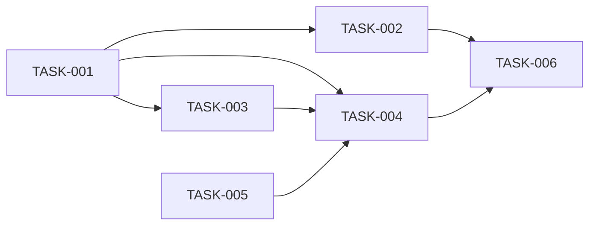

# 08 — Planlama: sudoku

- Tarih: 2026-07-25 | Mod: AUTOPILOT | Profil: LITE

## Milestone'lar
| M | Hedef | Kapsanan FR'ler | Hedef tarih |
|---|-------|-----------------|-------------|
| M1 | Oynanabilir MVP (tahta+giriş+ihlal+tamamlama+yeni oyun) | FR-1..5 | Faz 9 kapanışı |

## Backlog (önceliklendirilmiş, GitHub Issues formatına uyumlu)

### [M1] TASK-001: sudoku-core.js — saf mantık
- **Tahmin:** ≤1 gün
- **Bağımlılık:** —
- **FR:** FR-1, FR-2, FR-3, FR-4
- **Kabul:** `getPuzzle`, `randomTransform`, `applyTransform`, `setValue`, `cells`, `conflicts`, `isSolved` mimaride (Faz 5) tanımlı imzalarla çalışır; DOM'a dokunmaz; `node --test` ile birim test edilir.

### [M1] TASK-002: puzzles.js — bulmaca havuzu
- **Tahmin:** ≤1 gün
- **Bağımlılık:** TASK-001 (solver test-helper aynı anda yazılabilir)
- **FR:** FR-1, FR-5, NFR-2
- **Kabul:** Havuzdaki her `{givens, solution}` çifti `tests/helpers/solver.js` ile tekil-çözüm doğrulanır; en az 5 farklı bulmaca.

### [M1] TASK-003: render.js — class-diff view
- **Tahmin:** ≤1 gün
- **Bağımlılık:** TASK-001
- **FR:** FR-1, FR-3, FR-4, NFR-1
- **Kabul:** Yalnız değişen hücrelerde `classList.toggle`/`textContent`; `innerHTML` kullanılmaz; mantık içermez.

### [M1] TASK-004: app.js — controller + klavye/olay kablolaması
- **Tahmin:** ≤1 gün
- **Bağımlılık:** TASK-001, TASK-003
- **FR:** FR-2, FR-3, FR-4, FR-5, NFR-4
- **Kabul:** `init(root, pool, rng)`; keydown (rakam/Backspace/Delete/0/ok tuşları), roving tabindex, "Yeni Oyun" click → `getPuzzle` ile sıfırlama.

### [M1] TASK-005: index.html + styles.css — statik yüzey
- **Tahmin:** ≤1 gün
- **Bağımlılık:** —
- **FR:** FR-1, NFR-3, NFR-4
- **Kabul:** 81 statik `role="gridcell"` + `#status[aria-live]` + "Yeni Oyun" butonu (bkz. `docs/06-uiux/06-uiux.md`); derleme adımı yok.

### [M1] TASK-006: Entegrasyon testi + NFR doğrulama
- **Tahmin:** ≤1 gün
- **Bağımlılık:** TASK-001..005
- **FR:** NFR-1, NFR-2
- **Kabul:** Property test (200 rastgele `T` için çözüm korunumu — bkz. `docs/05-architecture.md` NFR-2 satırı); `conflicts` performans bütçesi testi (NFR-1).

## Bağımlılık grafı (kalite kapısı: çevrimsiz)

## Kalite kapısı raporu
- "Her task 1 günden küçük" → ✅ (6 task, her biri ≤1 gün tahmin)
- "Bağımlılık grafı çevrimsiz" → ✅ (yalnız ileri yönlü kenarlar, döngü yok)
